# TODO APP

###### This is a ToDo app that implements Django CRUD operations to allow the uset to create a TODO list, sign up and sign in as well as edit their profile page which is automatically created once a user registers.

This site is hosted on heroku.

Here's a link to the hosted website [SheReady ToDo App](https://sheready-todo-app.herokuapp.com/)

###### This are screenshots of the different webpages

###### Home Page View / List of ToDo list items

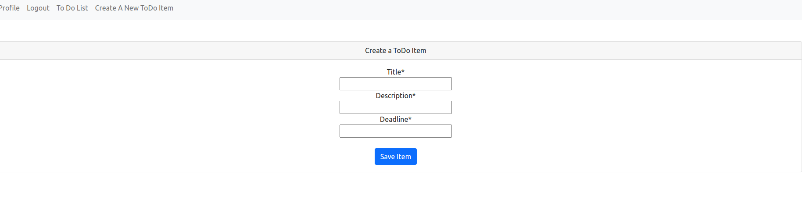

###### Create a TODo List Item

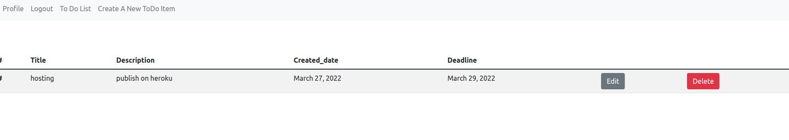

###### Update a ToDo list Item

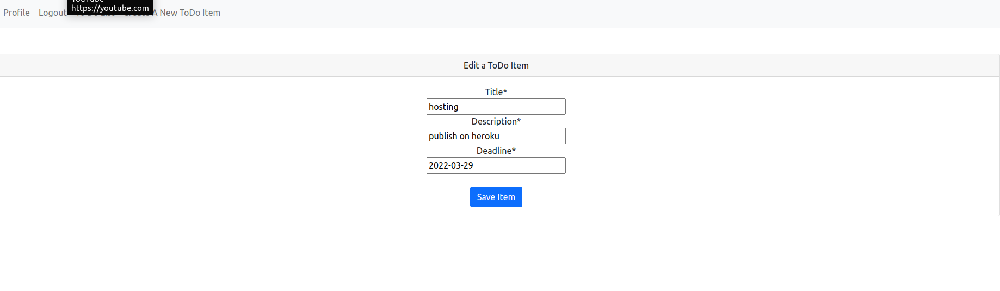

###### Delete a TODO List Item

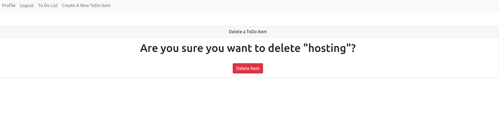

###### Profile page view

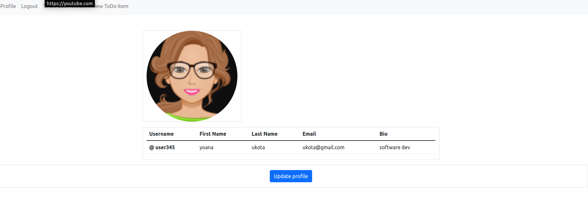

###### Django Rest Framework is also implemented in the api app to show crud operations as a browsable api

###### Create API View

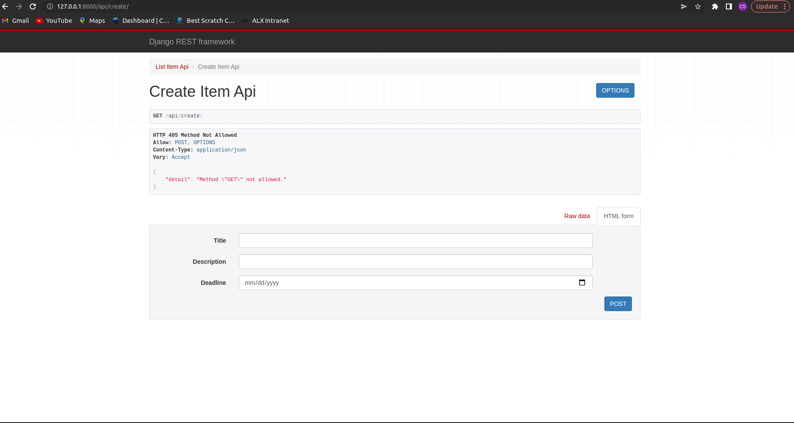

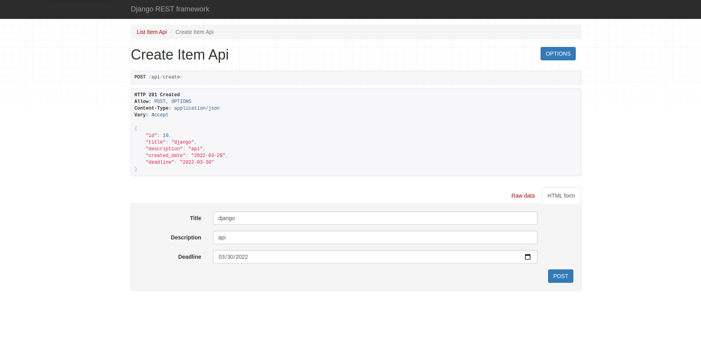

###### List API View

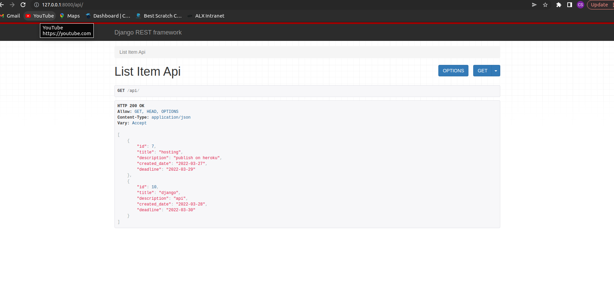

###### Update API View

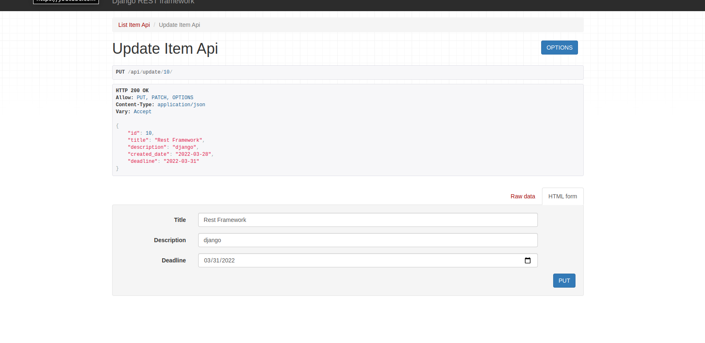

###### Delete API View

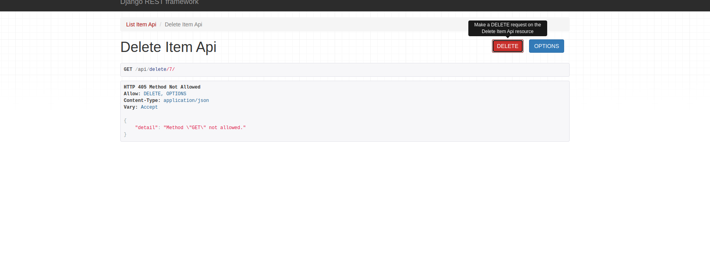

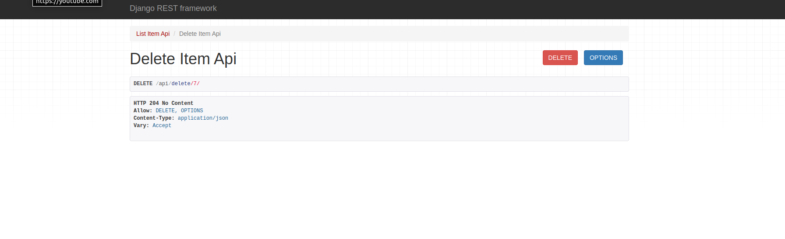

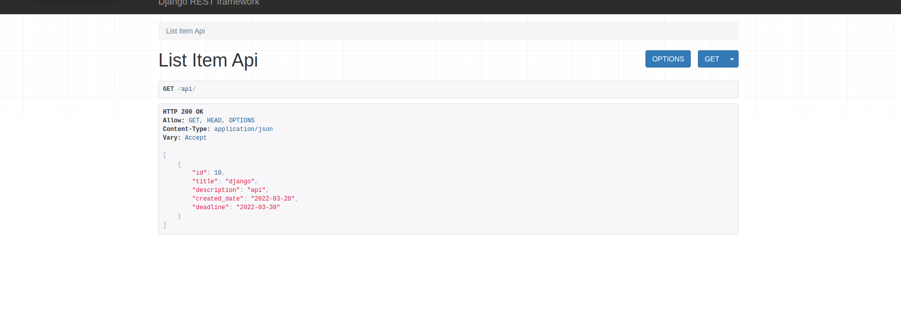

